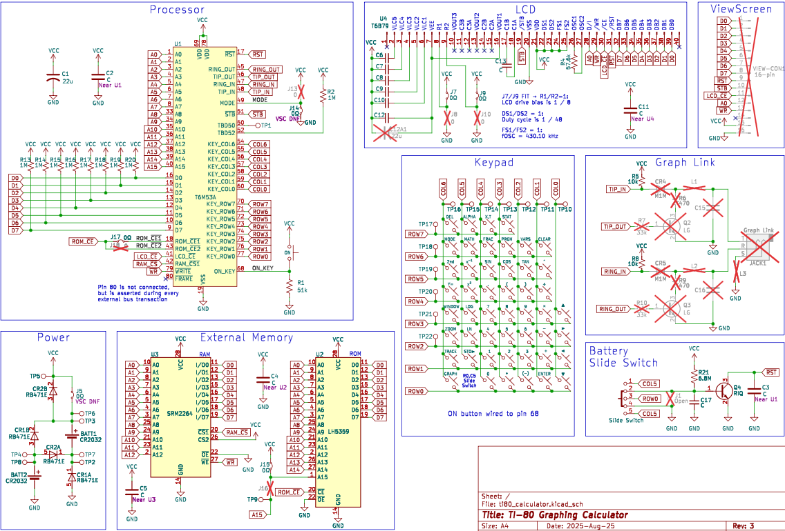

# TI-80 Calculator Reverse Engineering

This repository contains information about the TI-80 graphing calculator hardware and firmware.

## Hardware
The hardware architecture contains four main devices: CPU ASIC, external ROM, external RAM,
and LCD controller. These devices are wired together on a shared 8-bit bidirectional parallel bus
and 15 bit address bus. There are separate chip select/chip enable control pins going to the
individual ROM, RAM, LCD modules.

Full schematic is included in this repository along with the notes used to markup the PCB photos.
The schematic is broken into different sections grouping related components. It does not include
all the individual test points, but includes the ones of interest. Full schematic is included in
the repository as [TI-80 schematic PDF](schematics/ti80_schematic_rev1.pdf) or KiCad.

The PCB was reverse engineered using clean photos of the front and back PCB and marking up
the traces in Inkscape and probing individual pins and vias. The marked up document
can be viewed from the repository. It is stored as [TI-80 PCB layers Inkscape SVG](images/ti80_pcb_layers.svg)
with layers.

### Notable Parts:

REFDES | Footprint | Marking   | Manufacturer | Description       | Datasheet?
-------|-----------|-----------|--------------|-------------------|------------
 U1    | PQFP-80   | T6M53A    | Toshiba      | custom CPU ASIC   | None
 U2    | SOP-28    | LH5359    | TI           | external 32KB ROM | None, similar pinout to 23C256 or 27C256
 U3    | SOP-28    | SRM2264LM | Sharp        | external 8KB RAM  | [SRM2264LM](https://www.tautec-electronics.de/Datenblaetter/Schaltkreise/SRM2264LM.pdf)
 U4    | 40-pin    | T6B79     | Toshiba      | LCD controller    | [T6B79](https://datasheet.datasheetarchive.com/originals/distributors/Datasheets-38/DSA-757769.pdf)

### Notable findings:
1. External ROM supports up to 16 address bits, but A15 is tied high so only 32k are accessible
2. Pin 80 is unconnected, but strobes low for the duration of every external bus access (ROM, RAM, LCD)
3. Pin 52 is connected to a pull-up resistor R2 (1MΩ) so likely some sort of input. Tying this to GND doesn’t have obvious side effects
4. Pin 50 is wired out to a test pad, but not anything else. Monitoring it, seems to remain high
5. J5 shorts one of the diodes used for reverse polarity protection. This diode would like cause additional voltage drop and calculator becoming unusable due to the lower voltage powering the LCD
6. Calculator remains powered with only one battery installed, preserving the contents of SRAM. The slide switch in the battery compartment keeps /RST asserted while changing batteries. However, if manually de-asserted, the CPU, RAM, and ROM continue to run properly at 3V. The contrast of the LCD makes it unusable in this state.
7. J17/J18 control which CPU pin is connected to ROM /CE (fitted J17 = pin 18, not-fitted J18 = pin 43)

## Power
Most TI graphing calculators store programs in RAM and use a button cell battery for data retention
while swapping out the main batteries. The TI-80 also stores programs in RAM, but entirely powers
from two CR2032 batteries with no backup battery. Instead, it employs a novel physical switch in
the battery compartment that encourages the user to change one battery at a time and circutry inside
that can keep the SRAM powered by just one button cell while the batteries are changed, and so
the data is retained. The switch also holds the CPU and LCD in reset by asserting the /RST pin
while the battery compartment slide switch is in the change battery position.

## Firmware
The TI-80 firmware is baked into the ROMs on the calculator and it is not upgradable.
The ROM is split across 16KB embedded inside the main CPU ASIC (marking T6M53A)
and 32KB in the external ROM chip (marking LH5359).

There are two known public versions of the TI-80 firmware: 3.0 and 4.0. The firmware version
can be verified by entering the self-test mode with `Mode` | `Alpha` | `S`. Zeroko's ti80doc
notes, referenced below document the differences between the two ROMs.

## Graph Link
The TI-80 does not contain a graph link port in the consumer retail versions, however, the
ViewScreen enabled version does. The only supported feature of the graph link is requesting
screen shot data. The PCB is the same between both versions, so there are unpopulated pads
in the consumer version for the graph link port and supporting circuitry.

## Notes
Special thanks to Zeroko who have contributed vast knowledge of the TI-80:
* [ti80doc](https://www.ticalc.org/archives/files/fileinfo/442/44236.html) - TI-80 calculator HW/FW documentation
* [ti80emu](https://www.ticalc.org/archives/files/fileinfo/442/44237.html) - TI-80 emulator

### Other notes on TI-80 research and ROM extraction:
* [DataMath | Texas Instruments TI-80 ViewScreen™](http://www.datamath.org/Graphing/TI-80VSC.htm)
* [MAME | TI-80 calculator CPU](https://forums.bannister.org/ubbthreads.php?ubb=showflat&Number=60414)
* [TI Planet | dumping TI-80](https://tiplanet.org/forum/viewtopic.php?f=10&t=5019)
* [Cemetech | Dumping TI-80 ROM directly](https://www.cemetech.net/forum/viewtopic.php?t=20016)
* [Cemetech | TI-80 Hardware Revisions and ViewScreenification™](https://www.cemetech.net/forum/viewtopic.php?t=15350)
* [Silicon Prawn | T6M53A die photos](https://siliconprawn.org/map/toshiba/t6m53a/marmontel_mz_ms20x/)
* [onidev | T6M53A die photos](https://ic.onidev.fr/map/T6M53A.html)
